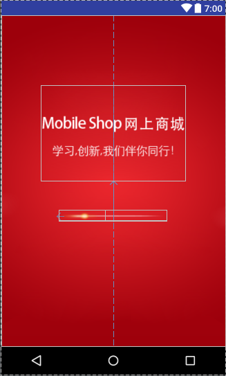
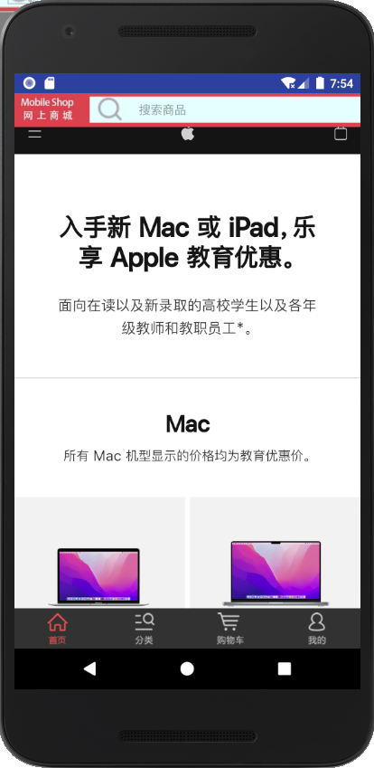
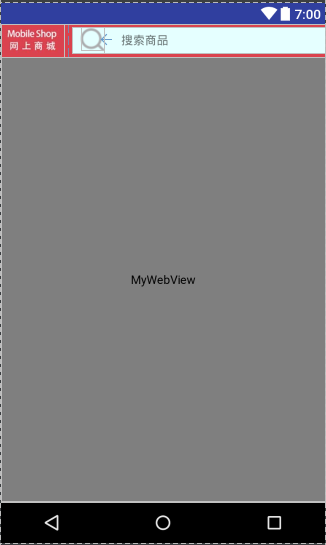

# 项目实战

## 一、引导页和首页的实现

### 1. 引导页的实现

1. 实现效果
    
2. 布局设计
    ``` xml
    <?xml version="1.0" encoding="utf-8"?>
    <RelativeLayout xmlns:android="http://schemas.android.com/apk/res/android"
        android:layout_width="match_parent"
        android:layout_height="match_parent"
        android:background="@drawable/splash_bg">

        <ImageView
            android:id="@+id/splash_logo"
            android:layout_width="wrap_content"
            android:layout_height="wrap_content"
            android:src="@drawable/splash_logo"
            android:layout_centerHorizontal="true"
            android:layout_marginTop="120dp"/>
        <RelativeLayout
            android:layout_width="wrap_content"
            android:layout_height="wrap_content"
            android:layout_below="@+id/splash_logo"
            android:layout_centerHorizontal="true"
            android:layout_marginTop="50dp">

            <ImageView
                android:layout_width="wrap_content"
                android:layout_height="wrap_content"
                android:src="@drawable/splash_loading_bg"/>
            <ImageView
                android:id="@+id/splah_loading_item"
                android:layout_width="wrap_content"
                android:layout_height="wrap_content"
                android:layout_alignParentLeft="true"
                android:src="@drawable/splash_loading_item"/>
        </RelativeLayout>

    </RelativeLayout>
    ```
3. 代码实现
    为了让App在启动时首先加载引导页，需要把AndroidMainfest.xml中将程序的入口从MainActivity改为SplashActivity。

    ``` xml
        <application
            android:allowBackup="true"
            android:icon="@mipmap/ic_launcher"
            android:label="@string/app_name"
            android:roundIcon="@mipmap/ic_launcher_round"
            android:supportsRtl="true"
            android:theme="@style/AppTheme">
            <activity android:name=".activity.MainActivity">

            </activity>
            <activity android:name=".activity.SplashActivity"
                android:launchMode="singleTask">
                <intent-filter>
                    <action android:name="android.intent.action.MAIN" />

                    <category android:name="android.intent.category.LAUNCHER" />
                </intent-filter>
            </activity>
    ```
    `<intent-filter>`就是用来注册Activity、Service和BroadcastReceiver在某种数据上执行一个动作的能力。
    android:name="android.intent.action.MAIN"决定应用程序最先启动的Activity。
    android:name="android.intent.category.LAUNCHER"决定应用程序是否显示在程序列表里。

    `<activity>`标签用于配置Activity组件`<provider>、<service>、<receiver>`分别用于配置Android的另外三个基本组件
    ContentProvider、Service和BroadcastReceiver

    Splash Activity代码如下：

    ``` java 
    package com.example.lhy.activityandfragmentdemo.activity;

    import android.app.Activity;
    import android.content.Intent;
    import android.os.Bundle;
    import android.support.annotation.Nullable;
    import android.view.animation.Animation;
    import android.view.animation.AnimationUtils;
    import android.widget.ImageView;

    import com.example.lhy.activityandfragmentdemo.R;

    /**
    * Created by LHY on 2021/11/18.
    */

    public class SplashActivity extends Activity {

        private ImageView splashItem;

        @Override
        protected void onCreate(@Nullable Bundle savedInstanceState) {
            super.onCreate(savedInstanceState);
            setContentView(R.layout.activity_splash);

            initView();
        }

        private void initView(){
            splashItem = findViewById(R.id.splah_loading_item);
            //AnimationUtils工具类属于补间动画
            Animation animation = AnimationUtils.loadAnimation(this,R.anim.splash_loading);
            animation.setAnimationListener(new Animation.AnimationListener() {
                @Override
                public void onAnimationStart(Animation animation) {

                }

                @Override
                public void onAnimationEnd(Animation animation) {
                    Intent intent = new Intent(SplashActivity.this,AdActivity.class);
                    startActivity(intent);
    //                startActivity(new Intent(SplashActivity.this,AdActivity.class));
                    overridePendingTransition(R.anim.push_left_in,R.anim.push_left_out);
                }

                @Override
                public void onAnimationRepeat(Animation animation) {

                }
            });
            splashItem.setAnimation(animation);
        }
    }
    ```
    其中我们使用了**import android.view.animation.AnimationUtils;**来加载一个xml动画文件，并获得一个animation对象，通过setAnimation()方法将该动画对象设置给mSplashItem_iv，达到动画加载的效果。
    动画文件如下：
    ``` xml
    <?xml version="1.0" encoding="utf-8"?>
      <translate xmlns:android="http://schemas.android.com/apk/res/android"

          android:duration = "3000"
          android:fromXDelta="0.0%"
          android:interpolator="@android:anim/accelerate_decelerate_interpolator"
          android:toXDelta="60%">
      </translate>
    ```

### 2. 广告载入的基本实现

1. 实现效果
    
2. 布局设计
    需要一张背景图片和一个左上角的跳过广告按钮，最好还能加上倒计时。
    ``` xml
    <?xml version="1.0" encoding="utf-8"?>
        <RelativeLayout xmlns:android="http://schemas.android.com/apk/res/android"
            android:layout_width="match_parent"
            android:layout_height="match_parent">

            <ImageView
                android:layout_width="match_parent"
                android:layout_height="match_parent"
                android:src="@drawable/sample_ad"/>
            <Button
                android:id="@+id/skip_btn"
                android:layout_width="60dp"
                android:layout_height="40dp"
                android:layout_alignParentRight="true"
                android:text="跳过"/>
        </RelativeLayout>
    ```
3. 代码实现
    activity实现
    ``` java
    package com.example.lhy.activityandfragmentdemo.activity;

    import android.app.Activity;
    import android.content.Intent;
    import android.os.Bundle;
    import android.os.Handler;
    import android.os.Message;
    import android.support.annotation.Nullable;
    import android.view.View;
    import android.widget.Button;

    import com.example.lhy.activityandfragmentdemo.R;

    /**
    * Created by LHY on 2021/11/18.
    */

    public class AdActivity extends Activity implements View.OnClickListener {

        private Button skipBtn;

        @Override
        protected void onCreate(@Nullable Bundle savedInstanceState) {
            super.onCreate(savedInstanceState);
            setContentView(R.layout.activity_ad);

            skipBtn = findViewById(R.id.skip_btn);
            skipBtn.setOnClickListener(this);

            timer();
        }

        @Override
        public void onClick(View v) {
            startActivity(new Intent(AdActivity.this,MainActivity.class));
        }

        private void timer(){
            final Handler handler = new Handler(){
                @Override
                public void handleMessage(Message msg) {
                    super.handleMessage(msg);
                    if (msg.what == -1){
                        startActivity(new Intent(AdActivity.this,MainActivity.class));
                    }
                }
            };
            new Thread(){
                @Override
                public void run() {
                    try {
                        Thread.sleep(3000);
                    } catch (InterruptedException e) {
                        e.printStackTrace();
                    }
                    handler.sendEmptyMessage(-1);
                }
            }.start();
        }
    }
    ```

### 3. 首页的实现

1. 实现效果和原理分析
具体实现上需要采用WebView和JavaScript的技术，由WebView加载一个HTML页面。在页面中使用JavaScript代码为链接定义点击事件，用特定的形式让其响应我们在Android中定义的事件。

2. 布局设计

    ``` xml
        <?xml version="1.0" encoding="utf-8"?>
        <LinearLayout xmlns:android="http://schemas.android.com/apk/res/android"
            android:orientation="vertical"
            android:layout_width="match_parent"
            android:layout_height="match_parent">
            <LinearLayout
                android:layout_width="match_parent"
                android:layout_height="40dp"
                android:orientation="horizontal"
                android:background="#ffda434e">
                <ImageView
                    android:id="@+id/logo"
                    android:layout_width="0dp"
                    android:layout_weight="1"
                    android:layout_height="wrap_content"
                    android:src="@drawable/logo"/>
                <RelativeLayout
                    android:layout_width="0dp"
                    android:layout_height="31dp"
                    android:layout_weight="4"
                    android:layout_marginLeft="10dp"
                    android:layout_marginTop="4dp"
                    android:gravity="center_vertical"
                    android:background="#e5ffff">
                    <ImageView
                        android:id="@+id/iv_search"
                        android:layout_width="wrap_content"
                        android:layout_height="wrap_content"
                        android:src="@drawable/icon_search"
                        android:layout_marginLeft="10dp"/>
                    <TextView
                        android:layout_width="match_parent"
                        android:layout_height="match_parent"
                        android:hint="搜索商品"
                        android:layout_toRightOf="@+id/iv_search"
                        android:gravity="center_vertical"
                        android:paddingLeft="20dp"/>
                </RelativeLayout>
            </LinearLayout>
            <android.support.v4.widget.SwipeRefreshLayout
                android:id="@+id/swipe_refresh_layout"
                android:layout_width="match_parent"
                android:layout_height="match_parent">
                <com.example.lhy.activityandfragmentdemo.view.MyWebView
                    android:id="@+id/webView"
                    android:layout_width="match_parent"
                    android:layout_height="match_parent">
                </com.example.lhy.activityandfragmentdemo.view.MyWebView>
            </android.support.v4.widget.SwipeRefreshLayout>
        </LinearLayout>
    ```
3. 自定义WebView
    为了实现下拉刷新，主要重写WebView的onScrollChanged方法，判断当前页面是否处于顶部。下拉刷新的操作动画，由Android的原生控件SwipeRefreshLayout完成，是否需要使用该方法如何判定，于是需要加上一个监听器。具体实现如下。
    ``` java
    package com.example.lhy.activityandfragmentdemo.view;

    import android.content.Context;
    import android.util.AttributeSet;
    import android.webkit.WebView;

    /**
    * Created by LHY on 2021/11/26.
    */

    public class MyWebView extends WebView {

        private IWebViewScroll mIWebViewScroll;

        public MyWebView(Context context) {
            super(context);
        }

        public MyWebView(Context context, AttributeSet attrs) {
            super(context, attrs);
        }

        public MyWebView(Context context, AttributeSet attrs, int defStyleAttr) {
            super(context, attrs, defStyleAttr);
        }

        //自定义接口
        public interface IWebViewScroll{
            void onTop();
            void notOnTop();
        }

        //判断页面是否处于顶部
        @Override
        protected void onScrollChanged(int l, int t, int oldl, int oldt) {
            super.onScrollChanged(l, t, oldl, oldt);
            if (mIWebViewScroll != null && t == 0){
                mIWebViewScroll.onTop();
            }else if (mIWebViewScroll != null && t != 0){
                mIWebViewScroll.notOnTop();
            }
        }

        //设置滑动监听
        public void setOnCustomScrollChanged(IWebViewScroll listener){
            this.mIWebViewScroll = listener;
        }
    }
    ```
4. HomeFragment页面的实现
    首页的实现，上面已经实现了布局和如何自定义MyWebView，现在来看下主页面的具体实现过程。代码如下：
    ``` java
    package com.example.lhy.activityandfragmentdemo.fragment;

    import android.app.Fragment;
    import android.graphics.Bitmap;
    import android.os.Bundle;
    import android.support.annotation.Nullable;
    import android.support.v4.widget.SwipeRefreshLayout;
    import android.view.KeyEvent;
    import android.view.LayoutInflater;
    import android.view.View;
    import android.view.ViewGroup;
    import android.webkit.WebResourceError;
    import android.webkit.WebResourceRequest;
    import android.webkit.WebSettings;
    import android.webkit.WebView;
    import android.webkit.WebViewClient;

    import com.example.lhy.activityandfragmentdemo.R;
    import com.example.lhy.activityandfragmentdemo.view.MyWebView;

    /**
    * Created by LHY on 2021/9/26.
    */

    public class HomeFragment extends Fragment {

        private MyWebView myWebView;
        private SwipeRefreshLayout swipeRefreshLayout;

        @Nullable
        @Override
        public View onCreateView(LayoutInflater inflater, @Nullable ViewGroup container, Bundle savedInstanceState) {
            View view = inflater.inflate(R.layout.fragment_home,container,false);

            myWebView = view.findViewById(R.id.webView);
            swipeRefreshLayout = view.findViewById(R.id.swipe_refresh_layout);

            //对myWebView进行设置
            initMyWebVie(view);
            initSwipeRefreshLayout();

            return view;
        }

        public void initMyWebVie(View view){
            myWebView.addJavascriptInterface(this,"app");//添加JavaScript接口
            myWebView.setVerticalScrollBarEnabled(false);//设置无垂直方向的scrollber
            myWebView.setHorizontalScrollBarEnabled(false);//设置无水平方向的scroller

            WebSettings settings = myWebView.getSettings();
            settings.setJavaScriptEnabled(true);//启用JS脚本
            settings.setSupportZoom(false);//支持缩放
            settings.setBuiltInZoomControls(false);//启用内置缩放设置

            myWebView.setOnCustomScrollChanged(new MyWebView.IWebViewScroll() {
                @Override
                public void onTop() {
                    //处在顶部的时候刷新
                    swipeRefreshLayout.setEnabled(true);
                }

                @Override
                public void notOnTop() {
                    //不在顶部的时候不刷新
                    swipeRefreshLayout.setEnabled(false);
                }
            });

            //点击后退按钮，让webView后退
            myWebView.setOnKeyListener(new View.OnKeyListener() {
                @Override
                public boolean onKey(View v, int keyCode, KeyEvent event) {
                    if (event.getAction() == event.ACTION_DOWN){
                        if (keyCode == event.KEYCODE_BACK && myWebView.canGoBack()){
                            myWebView.goBack();
                            return true;
                        }
                    }
                    return false;
                }
            });

            //页面加载
            myWebView.setWebViewClient(new WebViewClient(){
                //当点击链接时，在当前窗口打开，而不是在手机默认的浏览器打开
                @Override
                public boolean shouldOverrideUrlLoading(WebView view, String url) {
                    view.loadUrl(url);
                    return true;
                }

                @Override
                public void onPageStarted(WebView view, String url, Bitmap favicon) {
                    swipeRefreshLayout.setRefreshing(true);//页面开始加载时，刷新功能开启
                    super.onPageStarted(view, url, favicon);

                }

                @Override
                public void onPageFinished(WebView view, String url) {
                    swipeRefreshLayout.setRefreshing(false);
                    super.onPageFinished(view, url);
                }

                @Override
                public void onReceivedError(WebView view, WebResourceRequest request, WebResourceError error) {
                    swipeRefreshLayout.setRefreshing(false);
                    super.onReceivedError(view, request, error);
                }
            });

            myWebView.loadUrl("http://www.apple.com/cn-k12/shop");
        }

        //对刷新控件进行设置
        private void  initSwipeRefreshLayout(){
            swipeRefreshLayout.setColorSchemeResources(R.color.redLight,R.color.greenLight,
                        R.color.blueLight,R.color.yellowLight);
            swipeRefreshLayout.setOnRefreshListener(new SwipeRefreshLayout.OnRefreshListener() {
                @Override
                public void onRefresh() {
                    myWebView.reload();
                }
            });
        }
    }

    ```

## 二、会员中心的实现

### 1. ButterKnife框架概述

1. 概述
    android编程过程中，我们会编写大量的布局和点击事件，对这些事件和设置监听的操作会有大量的重复代码，于是引入ButterKnife（黄油刀）框架，这个框架采用了注解进行注入，在编译期就可以生成代码，但是编译有一点点时间成本。
2. 引入ButterKnife 框架
    在使用前，我们得先引入这个框架，实际上就是引入jar包类似的操作。具体代码如下。
    在Project级别下的目录build.gradle引入
    ``` 
        buildscript {
        repositories {
            mavenCentral()
        }
        dependencies {

            classpath 'com.neenbedankt.gradle.plugins:android-apt:1.8'

            // NOTE: Do not place your application dependencies here; they belong
            // in the individual module build.gradle files
        }
    }
    ```
    在module目录级别下的build.gradle引入
    ``` 
    apply plugin: 'com.android.application'
    android {...}
    dependencies {
        compile 'com.jakewharton:butterknife:8.4.0'
        apt 'com.jakewharton:butterknife-compiler:8.4.0'
    }
    ```
3. 使用说明
    - 在Activity中使用时，必须在setContextView()之后配置ButterKnife.bind(this);。
    - 在Fragment中使用时，必须在加载一个View视图之后配置ButterKnife.bind(this,RootView);。
    - 注解的属性不能使用private or static修饰，否则会报错。
4. Android ButterKnife Zelezny 插件的安装
   与idea安装插件的方式很像。

### 2. 会员模块的逻辑分析

1. 概述
    
2. 跳转逻辑分析与实现
   
### 3. 用户注册与登陆

1. 用户注册
2. 用户登陆

### 4. 密码管理

1. 找回密码
2. 修改密码
