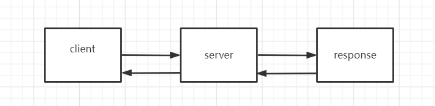
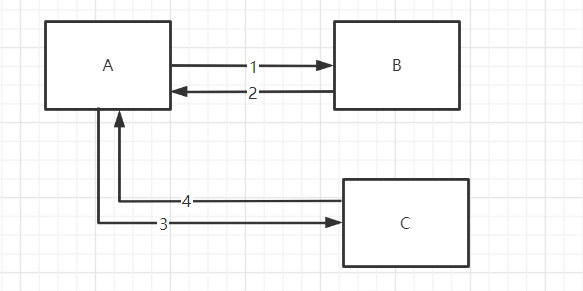

## 谈谈网站是如何访问的

1. 在浏览器中输入域名
2. 首先检查本机中的host文件，看是否存在域名的映射
3. 如果没有找到相对应的映射，则从dns服务器上进行查找

## 请求转发与重定向的区别

请求转发：

重定向：

**forward（转发）**：

是服务器请求资源,服务器直接访问目标地址的URL,把那个URL的响应内容读取过来,然后把这些内容再发给浏览器.浏览器根本不知道服务器发送的内容从哪里来的,因为这个跳转过程实在服务器实现的，并不是在客户端实现的所以客户端并不知道这个跳转动作，所以它的地址栏还是原来的地址.

**redirect（重定向）**：

是服务端根据逻辑,发送一个状态码,告诉浏览器重新去请求那个地址.所以地址栏显示的是新的URL.

转发是服务器行为，重定向是客户端行为。

不同点

- 请求转发url不会发生变化

- 重定向url会发生变化

相同点

- 都会发生页面的跳转

**区别**：

1. 从地址栏显示来说
   forward是服务器请求资源,服务器直接访问目标地址的URL,把那个URL的响应内容读取过来,然后把这些内容再发给浏览器.浏览器根本不知道服务器发送的内容从哪里来的,所以它的地址栏还是原来的地址.

redirect是服务端根据逻辑,发送一个状态码,告诉浏览器重新去请求那个地址.所以地址栏显示的是新的URL.

2. 从数据共享来说
   forward:转发页面和转发到的页面可以共享request里面的数据.
   redirect:不能共享数据.

3. 从运用地方来说
   forward:一般用于用户登陆的时候,根据角色转发到相应的模块.
   redirect:一般用于用户注销登陆时返回主页面和跳转到其它的网站等

4. 从效率来说
   forward:高.
   redirect:低.