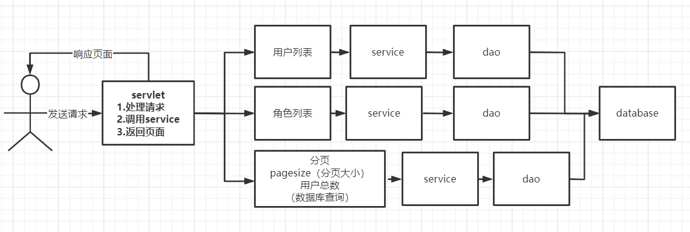
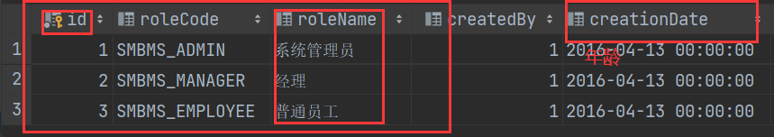

# SMBMS项目搭建

首先还是得了解项目架构：

这就得考考软件工程都学了些什么东西了！

1. 问题定义
2. 可行性研究
3. 需求分析
4. 概要设计
5. 详细设计
6. 编码
7. 测试
8. 维护


问题定义和可行性研究就不需要再进行额外的思考了，现在进行编码：

四大功能模块：

**登陆注销：**登陆功能

**用户管理：** 增删改查

**订单管理：**说到底还是增删改查

**供应商管理：**说到底还是增删改查

**数据库设计**：目前有现成的，直接使用就好


## 1、空的maven项目，搭建环境

1. 环境配置
   tomcat 的环境配置，最好先试试 start.bat 会不会出现闪退等问题
2. 选择maven-webapp 创建模板项目
3. 添加相关的配置，把web.xml中的版本信息修改成4.0版本
4. 试着跑一次空项目

```xml
<dependency>
    <groupId>javax.servlet</groupId>
    <artifactId>servlet-api</artifactId>
    <version>2.5</version>
</dependency>
<!-- https://mvnrepository.com/artifact/javax.servlet.jsp/javax.servlet.jsp-api -->
<dependency>
    <groupId>javax.servlet.jsp</groupId>
    <artifactId>javax.servlet.jsp-api</artifactId>
    <version>2.3.3</version>
    <scope>provided</scope>
</dependency>
<dependency>
    <groupId>mysql</groupId>
    <artifactId>mysql-connector-java</artifactId>
    <version>8.0.17</version>
</dependency>
<!-- https://mvnrepository.com/artifact/javax.servlet.jsp.jstl/jstl-api -->
<dependency>
    <groupId>javax.servlet.jsp.jstl</groupId>
    <artifactId>jstl-api</artifactId>
    <version>1.2</version>
</dependency>
<!-- https://mvnrepository.com/artifact/taglibs/standard -->
<dependency>
    <groupId>taglibs</groupId>
    <artifactId>standard</artifactId>
    <version>1.1.2</version>
</dependency>

```

导入相关依赖，然后发现，都是些老东西了，都tm不提示了都，就离谱。

编写实体类：ORM 实体类--表映射

编写基础公共类：实际上就是操作数据库的类，增删改查等等，这里使用自己以前写的工具类

```java
import java.lang.reflect.Field;
import java.sql.Connection;
import java.sql.PreparedStatement;
import java.sql.ResultSet;
import java.sql.ResultSetMetaData;
import java.util.ArrayList;
import java.util.List;

/*
 * 适用于任何表的增删改查
 * 输入值为sql语句，占位符的内容
 * */
public class MyQueryRunner {
    public int update(String sql , Object... args){
        Connection conn = null;
        PreparedStatement ps = null;
        int row = 0;
        try {
            //1. 获取连接
            conn = JDBCUtils.getConnection();
            //2. 获取PreparedStatement,发送sql语句
            ps = conn.prepareStatement(sql);
            //3. 给占位符赋值
            for (int i = 0; i < args.length; i++) {
                ps.setObject(i+1,args[i]);
            }
            //4. 执行sql语句
            row = ps.executeUpdate();
        } catch (Exception e) {
            e.printStackTrace();
        } finally {
            //5. 关闭连接
            JDBCUtils.close(conn,ps,null);
        }
        return row;
    }

    public <T> List<T> queryList(String sql , Class<T> clazz ,Object ... args){
        List<T> list = null;
        Connection conn = null;
        PreparedStatement ps = null;
        ResultSet rs = null;
        try {
            list = new ArrayList<>();

            //1.获取连接
            conn = JDBCUtils.getConnection();
            //2.获取PreparedStatement，发送sql语句
            ps = conn.prepareStatement(sql);
            //3.给占位符赋值
            for (int i = 0; i < args.length; i++) {
                ps.setObject(i+1,args[i]);
            }
            //4.执行sql语句
            rs = ps.executeQuery();
            //5.获取列数
            ResultSetMetaData rsmd = rs.getMetaData();
            int columnCount = rsmd.getColumnCount();
            while(rs.next()){
                //6.封装进对象内
                T t = clazz.newInstance();
                for (int i = 0; i < columnCount; i++) {

                    //6.1 获取结果集的列名（别名）
                    String columnName = rsmd.getColumnLabel(i+1);
                    //6.2 根据列名（别名）来获取列值
                    Object columnValue = rs.getObject(columnName);

                    //10. 由于使用的类未知，所以需要利用反射来进行赋值
                    Field field = clazz.getDeclaredField(columnName);// 注意：结果集的列名（别名）必须和属性名保持一致
                    field.setAccessible(true);//忽略访问权限
                    field.set(t,columnValue);  //这里每次只装一个数据，但是在两层循环下能将全部数据都装进去
                }
                list.add(t);
            }
        } catch (Exception e) {
            e.printStackTrace();
        } finally {
            JDBCUtils.close(conn,ps,rs);
        }

        return list;
    }

    public <T> T query(String sql ,Class<T> clazz, Object ... args){

        Connection conn = null;
        T t = null;
        PreparedStatement ps = null;
        ResultSet rs = null;

        try {
            //1. 获取连接
            conn = JDBCUtils.getConnection();
            //2. 获取PreparedStatement,发送sql语句
            ps = conn.prepareStatement(sql);
            //3. 给占位符赋值,注意mysql中索引是从1开始的，所以i+1
            for (int i = 0; i < args.length; i++) {
                ps.setObject(i+1,args[i]);
            }
            //4. 执行sql语句，获取ResultSet结果集  获取到了有几行，指针是在行数据的前一行，所以需要next()
            rs = ps.executeQuery();
            //5. 获取结果集的元数据 ResultSetMetaData()  为了下一步获取有几列
            ResultSetMetaData rsmd = rs.getMetaData();
            //6. 获取结果集的列数
            int columnCount = rsmd.getColumnCount();
            //7. 已经有列数了，所以对每一列进行获取数据
            if (rs.next()){  //看似是个if条件选择，实际上是个循环语句
                //需要将这些散列的数据封装进对象里头，更方便管理，这里是只封装进单个对象,
                t = clazz.newInstance();
                for (int i = 0; i < columnCount; i++) {
                    //8. 获取结果集列名，列别名
                    String columnName = rsmd.getColumnLabel(i + 1);

                    //9. 获取结果集中对应列值，由于不知道列值是什么类型的  所以这里使用Object代替
                    Object columnValue = rs.getObject(columnName);

                    //10. 由于使用的类未知，所以需要利用反射来进行赋值
                    Field field = clazz.getDeclaredField(columnName);// 注意：结果集的列名（别名）必须和属性名保持一致
                    field.setAccessible(true);//忽略访问权限
                    field.set(t,columnValue);  //这里每次只装一个数据，但是在两层循环下能将全部数据都装进去
                }
            }
        } catch (Exception e) {
            e.printStackTrace();
        } finally {
            //5. 关闭连接
            JDBCUtils.close(conn,ps,rs);
        }
        return t;
    }

}

```

```java
import java.io.InputStream;
import java.sql.*;
import java.util.Properties;

public class JDBCUtils {
    /*
    * 获取连接，关闭连接
    * @return
    * @Exception
    * */
    public static Connection getConnection() throws Exception {

        Properties props = new Properties();
        //属性文件路径，如 user password driverClassName 等等
        InputStream insss =JDBCUtils.class.getResourceAsStream("/db.properties");
        props.load(insss);
//        props.load(JDBCUtils.class.getClass().getClassLoader().getResourceAsStream("src/jdbc.properties"));
        String driverClassName = props.getProperty("driverClassName");
        String url = props.getProperty("url");
        String user = props.getProperty("user");
        String password = props.getProperty("password");

//        1.加载驱动
        Class clazz = Class.forName(driverClassName);
        // 2.获取连接
        Connection conn = DriverManager.getConnection(url,user,password);

        return conn;

    }
    //关闭连接，自下而上
    public  static void close(Connection conn , PreparedStatement ps, ResultSet rs){

        if (rs != null){
            try {
                rs.close();
            } catch (SQLException throwables) {
                throwables.printStackTrace();
            }
        }
        if (ps !=null){
            try {
                ps.close();
            } catch (SQLException throwables) {
                throwables.printStackTrace();
            }
        }

        if (conn != null){
            try {
                conn.close();
            } catch (SQLException throwables) {
                throwables.printStackTrace();
            }
        }

    }

}

```

首页引入：

```xml
<welcome-file-list>
    <welcome-file>login.jsp</welcome-file>
</welcome-file-list>
```

编写过滤器代码：

```java
package com.fanser.filter;

import javax.servlet.*;
import java.io.IOException;

public class CharacterEncodingFilter implements Filter {

    public void init(FilterConfig filterConfig) throws ServletException {
    }
    public void doFilter(ServletRequest request, ServletResponse response, FilterChain chain) throws IOException, ServletException {
        request.setCharacterEncoding("utf-8");
        response.setCharacterEncoding("utf-8");
        chain.doFilter(request,response);
    }
    public void destroy() {

    }
}
```

配置过滤器：

```xml
<filter>
    <filter-name>CharacterEncodingFilter</filter-name>
    <filter-class>com.fanser.filter.CharacterEncodingFilter</filter-class>
</filter>
<filter-mapping>
    <filter-name>CharacterEncodingFilter</filter-name>
    <url-pattern>/*</url-pattern>
</filter-mapping>
```

基本配置完成，然后把外部的静态资源导入。

## 2、登陆界面实现

还是先理清逻辑，我们需要哪些传入的信息，需要核对哪些信息，然后完成之后需要哪些工作？


简单的流程图算是完成了，那么现在需要哪些具体操作？

1. 从客户端输入的用户名和密码
2. 连接数据库校验
   1. 获取连接
   2. sql语句
   3. 获取结果
   4. 关闭连接
3. 验证成功--->后台界面
4. 验证失败--->返回原窗口

### 1、客户端输入的用户名和密码的获取

```java
public class LoginServlet extends HttpServlet {
    // Servlet 控制层 ，调用业务代码

    @Override
    protected void doGet(HttpServletRequest req, HttpServletResponse resp) throws ServletException, IOException {
        //获取view层中输入的用户名和密码
        String userCode = req.getParameter("userCode");
        String userPassword = req.getParameter("userPassword");
        //获取数据库中的用户名密码进行比对
        UserService userService = new UserServiceImpl();
        User user = userService.login(userCode, userPassword);
        System.out.println(userCode);
        System.out.println(userPassword);
        if (user!=null) {//查有此人
            //将用户信息放进session
            req.getSession().setAttribute(Constants.USER_SESSION,user);
        }
    }

    @Override
    protected void doPost(HttpServletRequest req, HttpServletResponse resp) throws ServletException, IOException {
        doGet(req, resp);
    }
}
```

### 2、连接数据库进行校验

#### 在数据库实现查找功能

```java
public interface UserDao {
    public User getLoginUser(String userCode,String userPassword);
}
```

```java
public class UserDaoImpl implements UserDao{
	//dao 层只需要考虑数据库相关的问题，因此有sql需要的字段传入即可
    @Override
    public User getLoginUser(String userCode, String userPassword) {
        ResultSet rs = null;
        User user = null;

        String sql = "select * from smbms_user where userCode=?";
        MyQueryRunner queryRunner = new MyQueryRunner();
        User user1 = queryRunner.query(sql,User.class,userCode);
        return user1;
    }
}
```

由于自己写的 **MyQueryRunner** 类中包含了创建连接，查询，关闭连接等等的操作，所以我们的工作简化了很多，只需要往里传入我们需要的sql 字段即可。

### 3、service层验证

```java
public class UserServiceImpl implements UserService{
    //业务层都会调用dao层，所以我们要引入Dao层；
    private UserDao userDao;
    public UserServiceImpl(){
        //无参构造中调用UserDao，确保创建类的时候必定会创建对应的类
        userDao = new UserDaoImpl();
    }
	//因为值需要完成登陆，所以目前还没有加上验证功能，所以看起来service层啥也没干，只是写了一遍重复的代码
    @Override
    public User login(String userCode, String userPassword) {
        User user = userDao.getLoginUser(userCode,userPassword);
        return user;
    }
}
```

这里很奇怪 我怎么也找不到frame.jsp文件，我搞不懂它是怎么读取的文件。

问题解决：把jsp文件从WEB-INF中移出来就能找到jsp文件了，但是这还不够，只是找到文件了还不行，定位会自动定位到你写的路径（被视为绝对路径了） 所以需要加上 req.getContextPath()来获取当前路径。


登陆成功后：需要对登陆后的界面进行优化，首先是登出功能---->**LogoutServlet**

找到相应的按钮处调用的url，然后再web.xml中进行配置，配置好了即可

```java
public class LogoutServlet extends HttpServlet
{
    @Override
    protected void doGet(HttpServletRequest req, HttpServletResponse resp) throws ServletException, IOException {
        //移除用户的constants.USER_SESSION
        req.getSession().removeAttribute(Constants.USER_SESSION);
        resp.sendRedirect(req.getContextPath()+"/login.jsp");
    }

    @Override
    protected void doPost(HttpServletRequest req, HttpServletResponse resp) throws ServletException, IOException {
        doGet(req, resp);
    }
}
```

然后出现新的问题：退出登陆后，session还在，然后可以直接跳过登陆验证，通过输入网址的方式来访问管理界面，所以还需要加上过滤器**SysFilter**，来防止这种情况。

```java
public class SysFilter implements Filter {
    @Override
    public void init(FilterConfig filterConfig) throws ServletException {

    }

    @Override
    public void doFilter(ServletRequest req, ServletResponse resp, FilterChain chain) throws IOException, ServletException {
        HttpServletRequest request = (HttpServletRequest) req;
        HttpServletResponse response = (HttpServletResponse) resp;
        //过滤器，从session中获取用户
        User user = (User) request.getSession().getAttribute(Constants.USER_SESSION);
        if (user==null){
            response.sendRedirect("/SMBMS2_war/error.jsp");
        }else{
            chain.doFilter(req,resp);
        }
    }

    @Override
    public void destroy() {

    }
}
```

添加过滤器之后还是得配置

```xml
    <filter>
        <filter-name>SysFilter</filter-name>
        <filter-class>com.fanser.filter.SysFilter</filter-class>
    </filter>
    <filter-mapping>
        <filter-name>SysFilter</filter-name>
        <url-pattern>/jsp/*</url-pattern>
    </filter-mapping>
```

权限管理就初步完成了

## 3、修改密码

还是先分析流程和逻辑

1. 首先修改密码肯定需要操作数据库，那么就肯定需要dao层来调用数据库，并且修改数据库的内容
2. 操作数据库之前肯定需要先查询到相应的数据，那就需要从客户端获取对应的信息，如用户名，密码等等
3. 光有了这些还不够，还得需要校验的过程，不然随便就把数据库修改了那不是大问题？需要比对数据库中原有的信息
4. servlet层与前端界面直接相接，需要获取从前端页面的数据，同时需要对页面做出响应（获取后端数据库的数据后）需要调用service层的操作，从中获取相应的数据后，对前端页做出相对应的响应（重定向到对应的窗口）（ajax实时响应相关的信息）

编码建议还是自底向上，方便后续的数据的更新，因为顶层并不知道底层会有哪些数据网上传输，先定义好方法后再考虑传入数据容易造成一个地方的修改全局都需要相应的修改。

所以，首先先编写dao层，确定数据库需要哪些数据来对数据进行修改。

然后是service层，对调用dao层，同时接收来自servlet层的前端数据，然后进行修改操作。

之后才是servlet层，调用service层，修改密码后，向前端发出响应，清空session，退回登陆界面。

最后是前端，对两次输入新密码是否一致的验证，还有通过ajax动态的向后端发送请求，验证旧密码是否正确。

### Dao 层

添加：

```java
//修改密码
public abstract int updatePassword()throws SQLException;
```

添加细节，实现类的实现（根据用户id来修改密码，id为主键，防止出现错误的修改了其他 userCode 一致的用户）：

```java
@Override
public int updatePassword(long id) throws SQLException {
    String sql = "update smbms set userPassword where id=?";
    
    MyQueryRunner queryRunner = new MyQueryRunner();
    int update = queryRunner.update(sql, id);
    return update;
}
```

### Service层

现在需要id，从上层要这个属性，所以现在是service层：

```java
@Override
public int update(long id) throws SQLException {
    int i = userDao.updatePassword(id);
    return i;
}
```

是不是非常简单，几乎没什么要写的代码，那是因为在 jdbcUtils 中，高度集成了一些方法。 

### Servlet层

最后是到了servlet层，这个层里需要干的活会多一些，先获取前端的数据，然后再传入数据到调用的service层的方法中，之后再根据加工后的参数来确定响应的内容。

```java
    @Override
    protected void doGet(HttpServletRequest req, HttpServletResponse resp) throws ServletException, IOException {
        String method = req.getParameter("method");
        if(method.equals("savepwd")){
            try {
                this.savePwd(req,resp);
            } catch (SQLException throwables) {
                throwables.printStackTrace();
            }
        }
    }
//用户修改密码方法
    public void savePwd(HttpServletRequest req, HttpServletResponse resp) throws ServletException, IOException, SQLException {
        //从Session中获取ID
        Object obj = req.getSession().getAttribute(Constants.USER_SESSION);
        //获取前端页面传来的旧密码
        String oldpassword = req.getParameter("oldpassword");
        //获取前端页面传来的新密码
        String newpassword = req.getParameter("newpassword");
//        System.out.println(oldpassword);
//        System.out.println(newpassword);
        //先判断不为空 再比较密码是否相等
        if(obj != null && oldpassword != null && newpassword != null){
            User user = (User) obj;
            //如果用户本身的密码 与 前端传来的旧密码 不同
            if(!user.getUserPassword().equals(oldpassword)){
//                System.out.println("用户本来"+user.getUserPassword());
//                System.out.println("前端填写"+oldpassword);
                req.getSession().setAttribute("message","旧密码填写错误!");
                //如果旧密码输入正确
            }else{
                UserService userService = new UserServiceImpl();
                //修改密码并返回结果
                int flag = userService.update(newpassword, user.getId());
                //如果密码修改成功 移除当前session
                if(flag>0){
                    req.setAttribute("message","修改密码成功，请使用新密码登录!");
                    req.getSession().removeAttribute(Constants.USER_SESSION);
                }else{
                    req.setAttribute("message","密码修改失败 新密码不符合规范");
                }
            }

        }else{
            req.setAttribute("message","新密码不能为空!");
        }
        //修改完了 重定向到此修改页面
        req.getRequestDispatcher("pwdmodify.jsp").forward(req,resp);

    }
```

### 使用Ajax来优化验证旧密码

需要使用json数据 ，需要先添加依赖 fastjson，借用其中的转换键值对的方法，把数据转换成json数据对象。

为什么要使用Ajax，验证旧密码是一个局部更新网页的过程，所以我们需要异步编程，鼠标指针离开页面时就向服务器发送请求，发送验证旧密码是否正确的请求，如果正确，则通过验证，允许发送新的密码，来实现更新密码的操作。


```java
//验证密码的方法
public void modifyPwd(HttpServletRequest req, HttpServletResponse resp)throws ServletException, IOException{
    //依旧从session中取ID
    Object obj = req.getSession().getAttribute(Constants.USER_SESSION);
    //取前端传来的旧密码
    String oldpassword = req.getParameter("oldpassword");
    //将结果存放在map集合中 让Ajax使用
    Map<String, String> resultMap = new HashMap<>();
    //下面开始判断 键都是用result 此处匹配js中的Ajax代码
    if(obj == null){
        //说明session被移除了 或未登录|已注销
        resultMap.put("result","sessionerror");
    }else if(oldpassword == null){
        //前端输入的密码为空
        resultMap.put("result","error");
    }else {
        //如果旧密码与前端传来的密码相同
        if(((User)obj).getUserPassword().equals(oldpassword)){
            resultMap.put("result","true");
        }else{
            //前端输入的密码和真实密码不相同
            resultMap.put("result","false");
        }
    }
    //上面已经封装好 现在需要传给Ajax 格式为json 所以我们得转换格式
    resp.setContentType("application/json");//将应用的类型变成json
    PrintWriter writer = resp.getWriter();
    //JSONArray 阿里巴巴的JSON工具类 用途就是：转换格式
    writer.write(JSONArray.toJSONString(resultMap));
    writer.flush();
    writer.close();
}
```

## 4、用户管理



还是先理思路，我们想要的页面里的内容其实很多，特别是跟查询相关的内容。


还有这些请求的发送，是否是异步编程，或者说先修改之后一次提交？


那我们先完成第一个个模块（分页模块）

### 分页管理


这部分包含哪些信息？ 先看前端需要哪些，方便后端获取。

```jsp
<input type="hidden" id="totalPageCount" value="${totalPageCount}"/>
    <c:import url="rollpage.jsp">
        <c:param name="totalCount" value="${totalCount}"/>
        <c:param name="currentPageNo" value="${currentPageNo}"/>
        <c:param name="totalPageCount" value="${totalPageCount}"/>
    </c:import>
```

url=“rollpage.jsp”


发现需要的数据其实就只有这些，那我们只需要后端来获取这些数据就好了

定义 PageSupport 页面支持：

```java
public class PageSupport {
   //当前页码-来自于用户输入
   private int currentPageNo = 1;   
   //总数量（表）
   private int totalCount = 0;
   //页面容量
   private int pageSize = 0;
   //总页数-totalCount/pageSize（+1）
   private int totalPageCount = 1;
   public int getCurrentPageNo() {
      return currentPageNo;
   }
   //确保用户输入的页码合法，不允许页码小于0
   public void setCurrentPageNo(int currentPageNo) {
      if(currentPageNo > 0){
         this.currentPageNo = currentPageNo;
      }
   }
   public int getTotalCount() {
      return totalCount;
   }
   //用户信息总数
   public void setTotalCount(int totalCount) {
      if(totalCount > 0){
         this.totalCount = totalCount;
         //设置总页数
         this.setTotalPageCountByRs();
      }
   }
   public int getPageSize() {
      return pageSize;
   }

   public void setPageSize(int pageSize) {
      if(pageSize > 0){
         this.pageSize = pageSize;
      }
   }
   public int getTotalPageCount() {
      return totalPageCount;
   }
   public void setTotalPageCount(int totalPageCount) {
      this.totalPageCount = totalPageCount;
   }
   public void setTotalPageCountByRs(){
      if(this.totalCount % this.pageSize == 0){
         this.totalPageCount = this.totalCount / this.pageSize;
      }else if(this.totalCount % this.pageSize > 0){
         this.totalPageCount = this.totalCount / this.pageSize + 1;
      }else{
         this.totalPageCount = 0;
      }
   }
}
```

实际上就是个接收数据的类似实体类的类。

数据怎么来的，肯定是来自数据库，全部信息，那就是count（1），所以：

### 获取用户数量 涉及多表查询

先想想select语句该怎么写，需要哪些表，多表查询之后的结果如何处理。

```sql
select count(1) as count from smbms_user u,smbms_role r where u.userRole = r.id
```



像这样来获取我们需要的数据的总数，同时也能满足需要获取的数据。

#### UserDao

添加方法：

```java
//根据用户名或角色查询用户总数
public int getUserCounts(String username,int userRole)throws SQLException;
```

#### UserDaoImpl

实现该方法：

```java
    //根据用户名或角色查询用户总数
    @Override
    public int getUserCounts(String username, int userRole) throws SQLException {
        int count = 0;
        //SQL语句因为联合多表查询 所以需要拼接
        StringBuffer sql = new StringBuffer();
        //默认两表联合查询总条数
        sql.append("select count(1) as count from smbms_user u,smbms_role r where u.userRole = r.id");
        //建一个集合来存储参数
        ArrayList<Object> list = new ArrayList<>();//存放可能会放进sql里的参数，就是用来替代?的params
        if (username != null) {//注意拼接sql语句前的空格，防止关键字和属性混在一起
            sql.append(" and u.userName like ?");
            list.add("%" + username + "%");//默认下标为0
        }
        if (userRole > 0 & userRole < 4) {
            sql.append(" and u.userRole = ?");
            list.add(userRole);//默认下标为1
        }
        //把list转换为数组
//        Object[] arrays = list.toArray();
        System.out.println("拼接的sql语句：" + sql.toString());
        //执行sql语句
        MyQueryRunner myQueryRunner = new MyQueryRunner();
        //将sql语句转换一下，传入换位符需要的值
        List<User> users = myQueryRunner.queryList(String.valueOf(sql), User.class, list);
        //获取结果集的长度：塞进去的对象的个数
        count = users.size();
        return count;
    }
```

#### UserService

添加方法：

```java
//根据条件（用户的查询输入）查询用户记录数
public int getUserCount(String queryUserName, int queryUserRole) throws SQLException;
```

#### UserServiceImpl

实现方法：

```java
@Override
public int getUserCount(String queryUserName, int queryUserRole) throws SQLException {
    int userCounts = userDao.getUserCounts(queryUserName, queryUserRole);
    return userCounts;
}
```

#### UserServlet


### 获取用户列表

还是老样子，从dao层开始，先试sql语句，获取我们需要的表之后再来考虑拼接sql

```sql
select u.*,r.roleName as userRoleName
from smbms_user u,smbms_role r
where u.userRole = r.id
```

这样的话，我们需要的数据就都有了，之后还是考虑前端需要其中的哪一部分

#### UserDao

添加方法：

```java
//根据条件查询用户列表
public List<User> getUserList(String queryUserName, int queryUserRole, int currentPageNo, int pageSize) throws Exception;
```

#### UserDaoImpl

```java
//获取用户列表通过用户输入的条件
    @Override
    public List<User> getUserList(String userName, int userRole, int currentPageNo, int pageSize) throws Exception {
        List<User> userList = new ArrayList<User>();
        StringBuffer sql = new StringBuffer();
        //数据库查询整张表，然后通过拼接的方式来筛选表中的部分数据
        sql.append("select u.*,r.roleName as userRoleName from smbms_user u,smbms_role r where u.userRole = r.id");
        List<Object> list = new ArrayList<Object>();
        if (!StringUtils.isNullOrEmpty(userName)) {
            sql.append(" and u.userName like ?");
            list.add("%" + userName + "%");
        }
        if (userRole > 0) {
            sql.append(" and u.userRole = ?");
            list.add(userRole);
        }
        //实现分页显示
        sql.append(" order by creationDate DESC limit ?,?");
        currentPageNo = (currentPageNo - 1) * pageSize;
        list.add(currentPageNo);
        list.add(pageSize);
        MyQueryRunner myQueryRunner = new MyQueryRunner();
        userList = myQueryRunner.queryList(String.valueOf(sql), User.class, list);
//        Object[] params = list.toArray();
        System.out.println("sql ----> " + sql.toString());
        return userList;
    }
```

#### UserService

添加方法：

```java
//根据条件查询用户列表
public List<User> getUserList(String queryUserName, int queryUserRole, int currentPageNo, int pageSize) throws Exception;
```

#### UserServiceImpl

实现方法：

```java
@Override
public List<User> getUserList(String queryUserName, int queryUserRole, int currentPageNo, int pageSize) throws Exception {
    List<User> userList = userDao.getUserList(queryUserName, queryUserRole, currentPageNo, pageSize);
    return userList;
}
```

然后发现了问题，可变个参数的传入，没错，又是这个问题！动态生成数组的时候我遇到过这个问题，现在我又遇到了这个问题，根据外部输入来生成数组是不能成功的，那么该如何按顺序往方法内送入不定个参数呢？

呜呜呜，解决不了，我没法改动这个MyQueryRunner()；实现动态的参数传入方法，只能使用数组或者集合（我知道的），可是这样子装进去的对象取出来后下标不太对。

### 获取用户 角色列表

这里就需要使用第二个表了，所以我们新建一个dao接口

参考UserDao，新建RoleDao，然后把一系列需要的类和接口都创建好

#### RoleDao

```java
public interface RoleDao {
    //获取角色列表
    public abstract List<Role> getRoleList()throws SQLException;
}
```

#### RoleDaoImpl

```java
public class RoleDaoImpl implements RoleDao{

    @Override
    public List<Role> getRoleList() throws SQLException {
        List<Role> roleList = new ArrayList<>();
        StringBuilder sql  = new StringBuilder("select * from smbms_role");
        MyQueryRunner myQueryRunner = new MyQueryRunner();
        roleList = myQueryRunner.queryList(sql.toString(), Role.class);
        return roleList;
    }
}
```

#### RoleService

```java
public interface RoleService {
    //获取角色列表
    public List<Role> getRoleList() throws SQLException;
}
```

#### RoleServiceImpl

```java
public class RoleServiceImpl implements RoleService{
    private RoleDao roleDao = null;
    public RoleServiceImpl(){
        this.roleDao = new RoleDaoImpl();
    }
    @Override
    public List<Role> getRoleList() throws SQLException {
        List<Role> roleList = roleDao.getRoleList();
        return roleList;
    }
}
```

#### 获取用户 显示的Servlet

这页面要的数据和内容有一些复杂，先分析一下我们需要做些什么


得知这些使用了EL表达式的属性基本上就是后台需要传回前端的数据了！我们servlet 要执行的方法名就叫query吧，从前端返回的参数也值得仔细看看，把能拿的都先拿回来，需要的也先注册上

##### 1、获取用户在前端输入的数据

​		req和resp

```java
//接收前端传来的参数
String queryUserName = req.getParameter("queryname");
String temp = req.getParameter("queryUserRole");//从前端传回来的用户角色码不知是否为空或者是有效角色码，所以暂存起来
String pageIndex = req.getParameter("pageIndex");
int queryUserRole=0;
//先设置一个默认的用户角色码，若temp为空，则将这个传进sql语句中，这是真正放进sql语句中的角色码

//通过UserServiceImpl得到用户列表,用户数
UserServiceImpl userService = new UserServiceImpl();
//通过RoleServiceImpl得到角色表
RoleService roleService = new RoleServiceImpl();
List<User> userList=null;//用来存储用户列表
List<Role> roleList=null;//用来存储角色表
//设置每页显示的页面容量
int pageSize=Constants.pageSize;
//设置当前的默认页码
int currentPageNo=1;
```

##### 2、根据参数的值 来判断请求是否执行

```java
//输出控制台，显示参数的当前值
System.out.println("queryUserName servlet--------"+queryUserName);
System.out.println("queryUserRole servlet--------"+queryUserRole);
System.out.println("query pageIndex--------- > " + pageIndex);
```

##### 3、计算分页需要的条件（当前页面、总页面、页面容量大小）

```java
//根据总记录条数以及当前每页的页面容量可以算出，一共有几页，以及最后一页的显示条数
PageSupport pageSupport = new PageSupport();
pageSupport.setCurrentPageNo(currentPageNo);
pageSupport.setPageSize(pageSize);
pageSupport.setTotalCount(totalCount);
//可显示的总页数
int totalPageCount=pageSupport.getTotalPageCount();
//约束首位页，即防止用户输入的页面索引小于1或者大于总页数
if(currentPageNo<1){
    currentPageNo=1;
}else if(currentPageNo>totalPageCount){
    currentPageNo=totalPageCount;
}
//有了，待查询条件，当前页码，以及每页的页面容量后，就可以给出每页的具体显示情况了
userList = userService.getUserList(queryUserName, queryUserRole, currentPageNo, pageSize);
```

##### 4、用户列表展示

```java
roleList = roleService.getRoleList();
//得到了用户表与角色表以及各种经过处理后的参数，都存进req中
req.setAttribute("userList",userList);
req.setAttribute("roleList",roleList);
req.setAttribute("queryUserName", queryUserName);
req.setAttribute("queryUserRole", queryUserRole);
req.setAttribute("totalPageCount", totalPageCount);
req.setAttribute("totalCount", totalCount);
req.setAttribute("currentPageNo", currentPageNo);
```

##### 5、返回前端展示

```java
//将所得到的的所有req参数送回给前端
req.getRequestDispatcher("userlist.jsp").forward(req,resp);
```

到这里，页面的大部分功能其实已经完成了，那现在就还差表格内的操作栏的内容了！

然后发现添加用户的操作比较特别，我们需要转到相应的页面才能操作，所以，依旧是老套路了。


### 用户管理——添加用户

首先还是先看看这个页面里面有些啥，然后才能根据需要的数据来判断我们需要对数据库进行哪些修改和操作。


好像熟悉的属性有点多，基本上都是用户表的内容，那就还是一样的操作，从底层开始

#### UserDao层

```java
//用户管理模块中的 —— 添加用户
public abstract int addUser(User user)throws SQLException;
```

#### UserDaoImpl

```java
//好像需要的参数不多，我又可以简化点使用自己的工具类了
@Override
public int addUser(User user) throws SQLException {
    //这sql属实有点长了，属性有点多
    String sql = "insert into smbms_user ( userCode, userName," +
        " userPassword,userRole, gender, birthday, phone, address)" +
        " VALUES(?,?,?,?,?,?,?,?) ;";
    Object[] params = {user.getUserCode(), user.getUserName(), user.getUserPassword(),
                       user.getUserRole(), user.getGender(), user.getBirthday(),
                       user.getPhone(), user.getAddress()};
    MyQueryRunner myQueryRunner = new MyQueryRunner();
    int update = myQueryRunner.update(sql, user);
    return update;
}
```

这里注册使用的属性只用了表单提交的属性，按道理来说，另外几个属性也是可以访问的，但是通过get不能获取，就很奇怪。我把属性都塞到session里了，按理来说应该是可以通过user来获取的。

#### UserService

```java
//用户管理模块中的 子模块—— 添加用户
public abstract int addUser(User user) throws SQLException;
```

#### UserServiceImpl

```java
@Override
public int addUser(User user) throws SQLException {
    int i = userDao.addUser(user);
    return i;
}
```

然后发现无法选择用户角色


显然是缺了点什么，代码没写全。

#### UserServlet

补上查询用户角色的代码：

```java
private void getRoleList(HttpServletRequest req, HttpServletResponse resp) throws ServletException, IOException, SQLException {
    List<Role> roleList = null;
    RoleService roleService = new RoleServiceImpl();
    roleList = roleService.getRoleList();
    //把roleList转换成json对象输出
    resp.setContentType("application/json");
    PrintWriter outPrintWriter = resp.getWriter();
    outPrintWriter.write(JSONArray.toJSONString(roleList));
    outPrintWriter.flush();
    outPrintWriter.close();
}
```

发现这样子还有问题，我们没法确保添加的用户不会重复，于是还要添加上防重复：

```java
private void ifExist(HttpServletRequest req,HttpServletResponse resp) throws IOException {
    //获取前端输入的用户编码
    String userCode = req.getParameter("userCode");
    UserService userService = new UserServiceImpl();
    User isNullUser = userService.login(userCode, "");
    //判断是否已经存在这个用户编码
    boolean flag = isNullUser != null ? true : false;
    //将结果存放在map集合中 让Ajax使用
    Map<String, String> resultMap = new HashMap<>();
    if(flag){
        //用户编码存在
        //将信息存入map中
        resultMap.put("userCode","exist");
    }
    //上面已经封装好 现在需要传给Ajax 格式为json 所以我们得转换格式
    resp.setContentType("application/json");//将应用的类型变成json
    PrintWriter writer = resp.getWriter();
    //JSONArray 阿里巴巴的JSON工具类 用途就是：转换格式
    writer.write(JSONArray.toJSONString(resultMap));
    writer.flush();
    writer.close();
}
```

到这里其实已经逻辑上是能完成了，然后实际操作发现就是赋不了值给这些属性赋值是不能完成这些操作的，于是乎还是得使另一个jdbc工具类，哎！

太痛苦了！拼接sql和？替换这些，非常容易看错，当参数多的情况下，十几个问号的情况下真的很容易数错有几个？，还有对应的列很容易多逗号

### 用户管理——删除用户

还是一样，先分析逻辑和需求，还有参考传递的数据

首先，被删除的用户是在用户列表中显示的，显示的信息包括有哪些？


包含userCode，userName，telephone，userRole等等可作为筛选条件的属性，那么我们该取哪条数据来执行筛选的操作呢？


知道需要啥参数来确定要删除的用户了不？ 其实一般来说，肯定是按id来删，毕竟id是主键，不存在重复的可能，不会出现误删的情况。

这里注意，使用了ajax，所以又需要使用json数据对象，所以还需要使用工具类fastjson。并且将验证信息通过map来放入。

之后就是写烂了五层操作了：

#### UserDao层

```java
//用户管理模块中的 —— 删除用户
public abstract int deleteUser(long userid)throws SQLException;
```

#### UserDaoImpl层

```java
@Override
public int deleteUser(long userid) throws SQLException {
    String sql = "delete from smbms_user where id = ?";
    MyQueryRunner myQueryRunner = new MyQueryRunner();
    int update = myQueryRunner.update(sql, userid);
    return update;
}
```

#### UserService层

```java
//用户管理模块中的 子模块—— 删除用户
public abstract int delete(long userid) throws SQLException;
```

#### UserServiceImpl层

```java
@Override
public int delete(long userid) throws SQLException {
    int i = userDao.deleteUser(userid);
    return i;
}
```

#### UserServlet

```java
private void deluser(HttpServletRequest req,HttpServletResponse resp) throws SQLException, IOException {
    String id = req.getParameter("uid");
    Integer delId = 0;
    try{
        delId = Integer.parseInt(id);
    }catch (Exception e) {
        // TODO: handle exception
        delId = 0;
    }
    //需要判断是否能删除成功
    HashMap<String, String> resultMap = new HashMap<String, String>();
    if(delId <= 0){
        resultMap.put("delResult", "notexist");
    }else{
        UserService userService = new UserServiceImpl();
        if(userService.delete(delId)>0){
            resultMap.put("delResult", "true");
        }else{
            resultMap.put("delResult", "false");
        }
    }

    //把resultMap转换成json对象输出
    resp.setContentType("application/json");
    PrintWriter outPrintWriter = resp.getWriter();
    outPrintWriter.write(JSONArray.toJSONString(resultMap));
    outPrintWriter.flush();
    outPrintWriter.close();

}
```

写到了这，还是不能忘记了注册，这还没把这个方法用上呢！

```java
else if (method!=null && method.equals("deluser")) {
    try {
        this.deluser(req,resp);
    } catch (SQLException throwables) {
        throwables.printStackTrace();
    }
}
```

这里并没有使用事务，按道理修改表的操作是需要添加上事务的，防止服务器端存在的错误导致表的内容变得不可预测。不过添加也很简单，只需要在工具类中稍作修改即可。`try{conn.setAutoCommit=false}catch{conn.rollback()}`

### 用户管理——修改用户信息

先看要干嘛，点击修改显然是进行一个页面跳转，那就看看这个页面的url是啥

```
http://localhost:8080/SMBMS2_war/jsp/user.do?method=modify&uid=6
```

看看jsp代码：

```jsp
<span><a class="modifyUser" href="javascript:;" userid=${user.id } username=${user.userName }></a></span>
```

没啥有用的信息，找到个class标签但是没有具体的方法，说明不在这，得看看js：

```js
$(".modifyUser").on("click",function(){
		var obj = $(this);
		window.location.href=path+"/jsp/user.do?method=modify&uid="+ obj.attr("userid");
	});
```

说到底还是得从dao层开始

#### UserDao

```java
//通过userId查看当前用户信息
public User getUserById(String id)throws Exception;
//修改用户信息
public int modify(User user)throws Exception;
```

添加两个方法，一个是展示，一个是修改

#### UserDaoImpl

```java
@Override
public User getUserById(String id) throws Exception {
    String sql = "select u.*,r.roleName as userRoleName from smbms_user u,smbms_role r where u.id=? and u.userRole = r.id";
    Object[] params={id};
    MyQueryRunner myQueryRunner = new MyQueryRunner();
    User user = myQueryRunner.query(sql, User.class, params);
    System.out.println(user);
    return user;
}

@Override
public int modify(User user) throws Exception {
    int updateNum = 0;
    String sql = "update smbms_user set userName=?,"+
            "gender=?,birthday=?,phone=?,address=?,userRole=?,modifyBy=?,modifyDate=? where id = ? ";
    Object[] params = {user.getUserName(),user.getGender(),user.getBirthday(),
            user.getPhone(),user.getAddress(),user.getUserRole(),user.getModifyBy(),
            user.getModifyDate(),user.getId()};
    MyQueryRunner myQueryRunner = new MyQueryRunner();
    updateNum = myQueryRunner.update(sql,params);
    return updateNum;
}
```

查询相关的代码还是比较简单的，注意的还是跟修改相关的。

#### UserService

```java
//通过id查询用户
public User findUserById(String id) throws Exception;
//修改用户信息
public Boolean modify(User user) throws Exception;
```

#### UserServiceImpl

```java
public User findUserById(String id) throws Exception {
    User user = userDao.getUserById(id);
    return user;
}

@Override
public Boolean modify(User user) throws Exception {
    boolean flag = false;
    int updateNum = userDao.modify(user);
    if (updateNum>0){
        flag = true;
    }else flag = false;
    return flag;
}
```

#### UserServlet

```java
private void getUserById(HttpServletRequest req, HttpServletResponse resp, String url) throws Exception {
    String id = req.getParameter("uid");
    if (!StringUtils.isNullOrEmpty(id)) {//判断前端传入的属性不为空
        //调用后台方法得到user对象
        UserService userService = new UserServiceImpl();
        User user = userService.findUserById(id);
        req.setAttribute("user", user);
        req.getRequestDispatcher(url).forward(req, resp);
    }
}

//修改用户信息
private void modify(HttpServletRequest req, HttpServletResponse resp) throws Exception {
    //需要拿到前端传递进来的参数
    String id = req.getParameter("uid");
    ;
    String userName = req.getParameter("userName");
    String gender = req.getParameter("gender");
    String birthday = req.getParameter("birthday");
    String phone = req.getParameter("phone");
    String address = req.getParameter("address");
    String userRole = req.getParameter("userRole");

    //创建一个user对象接收这些参数
    User user = new User();
    user.setId(Long.valueOf(id));
    user.setUserName(userName);
    user.setGender(Integer.valueOf(gender));
    try {
        user.setBirthday(new SimpleDateFormat("yyyy-MM-dd").parse(birthday));
    } catch (ParseException e) {
        e.printStackTrace();
    }
    user.setPhone(phone);
    user.setAddress(address);
    user.setUserRole(Integer.valueOf(userRole));
    user.setModifyBy(((User) req.getSession().getAttribute(Constants.USER_SESSION)).getId());
    user.setModifyDate(new Date());

    //调用service层
    UserServiceImpl userService = new UserServiceImpl();
    Boolean flag = userService.modify(user);

    //判断是否修改成功来决定跳转到哪个页面
    if (flag) {
        resp.sendRedirect(req.getContextPath() + "/jsp/user.do?method=query");
    } else {
        req.getRequestDispatcher("usermodify.jsp").forward(req, resp);
    }

}
```

doget方法中调用：

```java
 else if (method != null && method.equals("view")) {
    this.getUserById(req, resp, "userview.jsp");
} else if (method != null && method.equals("modify")) {
    this.getUserById(req, resp, "usermodify.jsp");
}else if(method != null && method.equals("modifyexe")){
    //验证用户
    this.modify(req, resp);
}else if(method != null && method.equals("pwdmodify")){
    //验证用户密码
    this.modifyPwd(req, resp);
}else if(method != null && method.equals("savepwd")){
    //更新用户密码
    this.savePwd(req, resp);
}
```

这里是不是感觉有点奇怪，前面写的明明只需要调用相对应的方法就可以了，这里怎么调用了这么多？

其实修改用户，说到底也包含了之前修改密码的操作，我们只需要再次调用一遍就好了！关键还是在于前后端的回调函数，特别关注他们之间的联系。

用户管理模块到这里已经差不多结束了！剩下的几个模块，就只是cv操作了已经，复制粘贴能解决大部分的问题。最难的多表查询的部分也在用户管理模块中，剩余的只需要参考这部分再实现一遍即可。

--------------

## 分割线


借个图参考一下


可见，剩余模块也都大致上相仿，都是些重复操作了属于是。

## 5、订单管理

## 6、供应商管理

