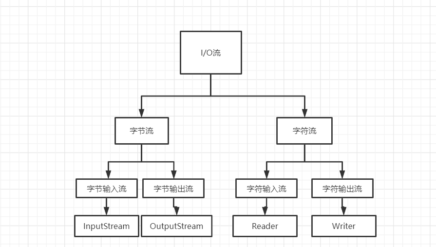
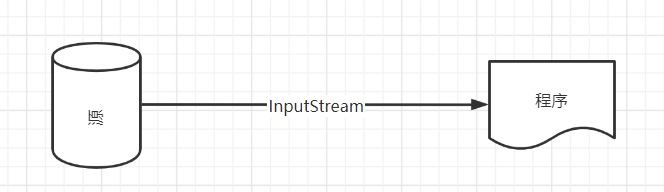
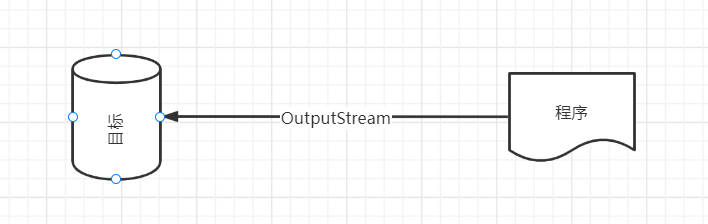

# I/O 流

io流的分类可以分为多种，主要的分类方式有三种：

1. 字节流和字符流
   根据数据单位的不同，可以分为字节流和字符流
2. 输入流和输出流
   根据流传输方向不同，可以分为输入流和输出流，输入流只能从流中读取数据而不能向其写入数据，输出流则相反。
3. 节点流和处理流
   根据流的功能不同，可以分为节点流和处理流

**InputStream的常用方法**

| 方法声明                            | 功能描述                                                     |
| :---------------------------------- | ------------------------------------------------------------ |
| int read()                          | 从输入流读取一个8位的字节，把他转化成0-255之间的整数，并返回这一整数。当没有字节可用时，将返回-1 |
| int read(byte[] b)                  | 从输入流读取若干字节，把他们保存到指定参数b指定的字节数组中，返回的整数表示读取字节的数目 |
| int read(byte[] b ,int off,int len) | 从输入流读取若干字节，把他们保存到参数b指定的字节数组中，off指定字节数组开始保存数据的起始下标，len表示读取的字节数目 |
| void close()                        | 关闭此输入流并释放与该流关联的所有系统资源                   |

与InputStream相对应的是OutputStream，OutputStream是用于写数据的，因此OutputStream提供了一些写数据有关的方法。

| 方法声明                              | 功能描述                                               |
| ------------------------------------- | ------------------------------------------------------ |
| void write()                          | 向输出流中输出一个字节                                 |
| void write(byte[] b)                  | 把参数b指定的字节数组中的所有字节写到输出流            |
| void write(byte[] b ,int off,int len) | 将指定byte数组中从偏移量off开始的len个字节写入到输出流 |
| void flush()                          | 刷新此输出流并强制写出所有缓冲的输出字节               |
| void close()                          | 关闭此输入流并释放与该流相关联的所有系统资源           |

