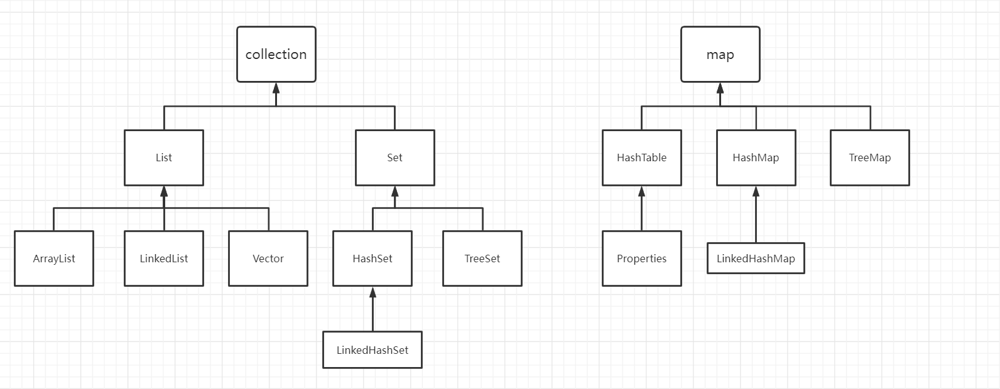

# 集合



麻了，刚写完一遍没保存，损失惨重。

### 集合遍历的几种方式

Java提供了四种在集合上遍历的方法，包括循环，迭代和 forEach（从Java 8开始）

1. 经典的遍历方式

```java
    for (int i = 0; i < listNames.size(); i++) {
        String name = listNames.get(i);
        System.out.println(name);
    }
```
2. 迭代实现
 ```java
       Iterator<String> itr = listNames.iterator();
   
       while (itr.hasNext()) {
           String name = itr.next();
           System.out.println(name);
       }
   ```

3. 加强for循环

   ```java
       for (String s : listNames) {
           System.out.println(s);
       }
   ```

4. forEach
   ```java
       listNames.forEach(name -> System.out.println(name));
   ```

   

