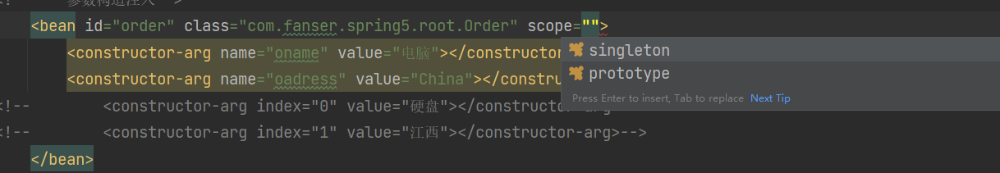
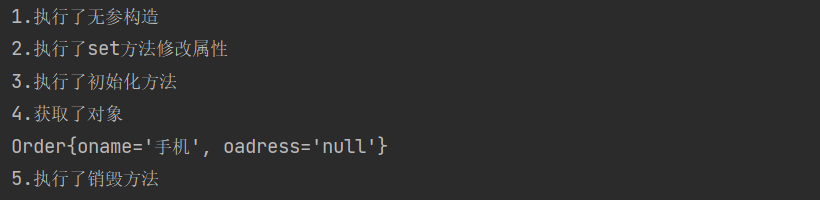

## Spring概述

> 为了解决企业应用开发的复杂性问题

1. Spring是轻量级的开源的javaEE框架
2. Spring可以解决企业应用开发的复杂性
3. Spring有两个核心部分：IOC 和 Aop
    - IOC：控制反转，把创建对象的过程交给Spring进行管理
    - Aop：面向切面，不修改源代码进行功能增强
4. Spring特点
    - 方便解耦，简化开发
    - Aop编程支持
    - 方便程序的测试
    - 方便可以和其他框架进行整合
    - 方便进行事务操作
    - 降低API的使用难度

Spring下载地址：
<https://repo.spring.io/ui/native/release/org/springframework/spring/>

## IOC：控制反转，把创建对象的过程交给Spring进行管理

### 入门案例

通过Spring来创建一个user类（工厂模式）


1. 先新建一个普通的User类
2. 添加jar包，Spring的四大基本jar包，aop、 bean、 core、 exception
3. 创建一个spring的xml文件
4. 创建一个bean对象
5. 通过ApplicationContext 来装入加载的Spring配置文件
6. 获取Spring配置文件


基于xml方式注入属性

1. set方法注入
   
``` java
/*
* 使用set方式来注入属性
* */

public class Book {
    //创建相应的属性
    private String bname;
    private String bauthor;
    //创建相应的set方法

    public void setBname(String bname) {
        this.bname = bname;
    }

    public void setBauthor(String bauthor) {
        this.bauthor = bauthor;
    }
}
```

1. 使用spring配置文件配置对象创建，配置属性注入
   

``` xml
    <bean id="book" class="com.fanser.spring5.root.Book">
        <property name="bname" value="spring"></property>
        <property name="bauthor" value="xxxx"></property>
    </bean>
```

第二种注入方式：通过有参构造器方式注入属性

1. 创建相应的类
``` java
/*
* 创建对象类
* */

public class Order {
    private String oname;
    private String oadress;

    public Order(String oname, String oadress) {
        this.oname = oname;
        this.oadress = oadress;
    }
}
```
2. 在spring配置文件中进行配置

``` xml
 <bean id="order" class="com.fanser.spring5.root.Order">
        <constructor-arg name="oname" value="电脑"></constructor-arg>
        <constructor-arg name="oadress" value="China"></constructor-arg>
<!--        <constructor-arg index="0" value="硬盘"></constructor-arg>-->
<!--        <constructor-arg index="1" value="江西"></constructor-arg>-->
</bean>

```
3. p名称空间注入（了解）

``` xml
 xmlns:p="http://www.springframework.org/schema/p"
 <bean id="book" class="com.fanser.spring5.root.Book" p:bname="java" p:bauthor="xyz"> </bean>
```

### IOC操作bean管理（xml注入其他类型属性）

- 注入属性：字面量（内容）
1. null值
`<property name="bname"><null/></property>`
2. 属性值含特殊符号
`<property name="bauthor"><value><![CDATA[<<ljr>>]]></value></property>`

- 注入属性：外部bean
1. 创建两个类 service类和dao类
2. 在service类中调用dao里面的方法
3. 在spring配置文件中进行配置

一般流程：
通过在service类中来创建dao类对象的实例来调用相应的方法
使用spring来简化这部分的操作：
使用bean来分别创建这两个类，创建相对应的类实例后，进行相应的赋值等操作，这里注意，一个类需要使用另一个类的方法时，需要对相应的类的bean的id进行一个类似“引用”的操作

``` xml
<!--    配置service 和dao 对象创建-->
        <bean id="userDao" class="com.fanser.spring5.dao.UserDaoImpl"></bean>
        <bean id="userService" class="com.fanser.spring5.service.UserServiceImpl">
<!--                注意这里对属性值的赋值，要求跟上面新初始化的对象名字统一
                    ref 内的内容为通过bean创建的id值，即对象名
 -->
                <property name="userDao" ref="userDao"></property>
        </bean>
```

- 注入属性：内部bean和级联赋值
``` xml
<!-- 内部bean -->

<bean id="emp" class="com.fanser.spring5.bean.Emp">
    <property name="ename" value="lucy"></property>
    <property name="gender" value="女"></property>
    <property name="dept">
        <bean id="dept" class="com.fanser.spring5.bean.Dept">
            <property name="dname" value="人事部"></property>
        </bean>
    </property>
</bean>

<!--    级联赋值 方式一 -->

<bean id="emp" class="com.fanser.spring5.bean.Emp">
    <property name="ename" value="lucy"></property>
    <property name="gender" value="女"></property>
    <property name="dept" ref="dept">
    </property>
</bean>
<bean id="dept" class="com.fanser.spring5.bean.Dept">
    <property name="dname" value="财务部"></property>
</bean>

<!-- 级联赋值 方式二 -->

<bean id="emp" class="com.fanser.spring5.bean.Emp">
    <property name="ename" value="lucy"></property>
    <property name="gender" value="女"></property>
    <property name="dept" ref="dept"></property>
    <property name="dept.dname" value="技术部">
    </property>
</bean>
```

注意：在级联赋值方式二中，需要相对应的get方法（一对多关系中多的一方）


注入集合（Collection type）属性：

与注入其他属性相似，但是由于集合是多个对象都要装进同一个集合中，所以xml文档的书写有小部分的不同之处。
需要将多个属性注入同一个集合中，所以直接通过value属性不足以完成全部操作。

``` xml
<!--    数组方式-->
    <bean id="stu" class="com.fanser.spring5demo2.collectiontype.root.Stu">
        <property name="courses">
            <array>
                <value>java</value>
                <value>php</value>
            </array>
        </property>

<!--    list集合方式-->

        <property name="list">
            <list>
                <value>java</value>
                <value>php</value>
            </list>
        </property>

<!--    map集合方式-->
        <property name="map">
            <map>
                <entry key="JAVA" value="java"></entry>
                <entry key="JS" value="javascript"></entry>
            </map>
        </property>
<!--    set集合方式-->
        <property name="sets">
            <set>
                <value>AA</value>
                <value>BB</value>
            </set>
        </property>
    </bean>
</beans>
```

这样也还是有一些不方便的地方，尝试把其中的属性从bean中抽取出来，这样调用的时候就能够实现不同的集合能够调用同样的内容了。所以接下来使用新的util方式来抽取属性内容。  

在xml文件默认的xs名称空间中调整其中的内容，添加上这一行（只需要把bean换成util即可）

``` xml
http://www.springframework.org/schema/util http://www.springframework.org/schema/util/spring-util.xsd
```

然后是使用这部分的内容，就像之前学的p名称空间注入，都有特别的格式。

``` xml
<!--        提取list集合中注入的属性-->
        <util:list id="booklist">
            <value>java</value>
            <value>python</value>
            <value>c++</value>
        </util:list>
```

像这样提取出来的属性就能在多个集合中共享这部分内容了，进一步减少了代码的冗余。

### IOC操作Bean管理（FactoryBean）

Spring中有两种类型的bean，一种是普通bean，一种是工厂bean（FactoryBean）

1. 普通bean，配置文件定义的bean类型就是返回类型。
2. 工厂Bean，在配置文件定义的bean类型可以和返回类型不一致。例如定义Book类型可以返回到Dept类型，这样来定义一个类。
    ps：其实有点类似多态的操作。

### IOC操作Bean管理（Bean作用域）

1. 在Spring里，可以设置创建bean实例为单实例还是多实例。
2. 在Spring里，创建bean实例默认为单实例对象。（单实例是指地址空间是一致的，代表没有在新的地址空间创建新的实例）
3. 如何设置单实例还是多实例。
    3.1 在Spring配置文件bean标签中有属性（scope）用于设置单实例还是多实例。
    3.2 scope属性值

     - 第一个值，singleton 默认值，代表单实例对象。
     - 第二个值，prototype 代表多实例对象。
     - （还有request和session，一般不怎么使用，了解即可） 
    

    3.3 singleton和prototype的区别
     - singleton是单实例，prototype是多实例
     - 设置scope的值为singleton的时候，加载spring配置文件的时候就会创建单实例对象。设置scope的值为prototype的时候，在调用getBean方法时才会创建多实例对象。
    
    

### IOC操作Bean管理（Bean生命周期）

**生命周期**

   1. 从对象创建到被销毁的过程。

**Bean生命周期**

   1. 通过构造器来创建bean实例（无参数构造）
   2. 为bean的属性设置值和对其他bean引用（通过set方法）
   3. 调用bean的初始化方法（需要进行配置初始化的方法）
   4. 可以对bean进行使用了（对象获取成功）
   5. 当容器关闭的时候，需要对bean销毁的方法（需要进行配置销毁的方法）

普通bean生命周期具体流程：

    1. 创建对象类
    2. 在对象类中添加set方法，和无参构造方法
    3. 创建xml配置文件
    4. 通过bean创建对象类，通过无参构造器来创建类 （1）
    5. 设置属性值（2）
    6. 对象类中添加初始化方法，并在bean中调用init-method属性来调用该方法（3）
    7. 通过getBean方法来创建该类（4）
    8. 在对象类中添加销毁方法，同样在bean中调用destory-method属性来调用该销毁方法（5）

xml配置文件

``` xml
<!--        1.通过无参构造器创建bean-->
        <bean id="order" class="com.fanser.spring5demo2.bean.Order" init-method="initMethod" destroy-method="destoryMethod">
<!--            2.对bean的属性进行设置,需要调用set方法-->
            <property name="oname" value="手机"></property>
        </bean>
```
创建对象类

``` java
package com.fanser.spring5demo2.bean;

/*
* 创建对象类
* */

public class Order {
    private String oname;

    // 1.无参构造
    public Order() {
        System.out.println("1.执行了无参构造");
    }
    // 2.set方法修改属性
    public void setOname(String oname) {
        this.oname = oname;
        System.out.println("2.执行了set方法修改属性");
    }
    // 3.初始化方法
    public void initMethod(){
        System.out.println("3.执行了初始化方法");
    }
    // 5.销毁方法
    public void destoryMethod(){
        System.out.println("5.执行了销毁方法");
    }
}
```
对该对象进行测试 观察生命周期
``` java test
    @Test
    public void beantest(){
        ApplicationContext context = new ClassPathXmlApplicationContext("bean5.xml");
        Order order = context.getBean("order", Order.class);
        System.out.println("4.获取了对象");
        System.out.println(order);
//        5.手动让实例销毁,这里需要进行强制类型转换，因为context方法本身并没有close()方法
        ((ClassPathXmlApplicationContext) context).close();
    }
```



**Bean的后置处理器，这样的bean生命周期有七步**

   1. 通过构造器来创建bean实例（无参构造器）
   2. 为bean的属性设置值和对其他bean引用（通过set方法）
   3. **把bean实例传递给后置处理器的方法** postProcessBeforeInitialization
   4. 调用bean的初始化方法（需要进行配置初始化的方法）
   5. **把bean实例传递给后置处理器的方法** postProcessAfterInitialization
   6. 可以对bean进行使用了（对象获取成功）
   7. 当容器关闭的时候，需要对bean销毁的方法（需要进行配置销毁的方法）

Bean的后置处理器生命周期具体操作流程：

   1. 创建类，实现接口BeanPostProcessor，创建后置处理器 继承的接口中是默认有两个方法的，复制粘贴然后对其修改更好展示其作用。
   2. 在xml配置文件中添加后置处理器（直接创建bean添加创建的类对象即可，该类继承于BeanPostProcessor，所以可以知道添加了后置处理器）再添加了后置处理器之后，该xml文件中的所有bean都会使用后置处理器。


后置处理器的创建
``` xml
<!--    配置后置处理器
        只要配置了后置处理器，那么这整个xml文件中的bean都会添加后置处理器
-->
        <bean id="myBean" class="com.fanser.spring5demo2.bean.root.MyBean"></bean>
```
后置处理器对象的创建
``` java 
package com.fanser.spring5demo2.bean.root;

import org.springframework.beans.BeansException;
import org.springframework.beans.factory.config.BeanPostProcessor;
import org.springframework.lang.Nullable;

public class MyBean implements BeanPostProcessor {
    // 这两个方法其实就是BeanPostProcessor中的源码，稍微修改即可
    @Override
    public Object postProcessBeforeInitialization(Object bean, String beanName) throws BeansException {
        System.out.println("在初始化执行之前执行的方法");
        return bean;
    }

    @Override
    public Object postProcessAfterInitialization(Object bean, String beanName) throws BeansException {
        System.out.println("在初始化执行之后执行的方法");
        return bean;
    }
}
```


### IOC操作Bean管理（xml自动装配）

1. **什么是自动装配**
   1. **手动装配** 通过手动修改属性
   2. 两种自动装配的方式 使用autowire属性中的 ByName 、ByType 
``` xml
<!-- 1.手动装配方式 -->
<!--        1.通过无参构造器创建bean-->
    <bean id="order" class="com.fanser.spring5demo2.bean.Order" >
<!--            2.对bean的属性进行设置,需要调用set方法-->
        <property name="oname" value="手机"></property>
    </bean>
```

``` xml
<!-- 2.自动装配方式 -->
<!--        1.通过无参构造器创建bean-->
<!-- 1. -->
    <bean id="order" class="com.fanser.spring5demo2.bean.Order" autowire="ByName">
<!-- 2. -->
    <!-- <bean id="order" class="com.fanser.spring5demo2.bean.Order" autowire="ByType"> -->
<!--            2.对bean的属性进行设置,需要调用set方法-->
        <!-- <property name="oname" value="手机"></property> -->
    </bean>
```

**通过设置<bean>元素的autowire属性指定自动装配，代替了通过<property>标签显示指定Bean的依赖关系。由BeanFactory检查XML配置文件的内容，为Bean自动注入依赖关系。**

Spring提供了多种自动装配方式，autowire属性常用的取值如下所示

- no　　　　　　 不使用自动装配。Bean依赖关系必须通过property元素定义
- byType　　　　根据属性类型自动装配。BeanFactory查找容器中的全部Bean，如果正好有一个与依赖属性类型相同的Bean，就自动装配这个属性；如果有多个这样的Bean，Spring无法决定注入哪个Bean，就抛出一个致命异常；如果没有匹配的Bean，就什么都不会发生，属性不会被设置
- byName　　　  根据属性名自动装配。BeanFactory查找容器中的全部Bean，找出id与属性的setter方法入参匹配的Bean。找到即自动注入，否则什么都不做
- constructor　　与byType的方式类似，不同之处在于它应用于构造器参数。如果在容器中没有找到与构造器参数类型一致的Bean，那么将会抛出异常

在Spring配置文件中通过<bean>元素的autowire属性可以实现自动装配。但是，如果要配置的Bean很多，每个Bean都配置autowire属性也会很繁琐，可不可以统一设置自动注入而不必分别配置每个Bean呢？

### IOC操作Bean管理（外部配置文件读取--数据连接池的引入）

### IOC操作Bean管理 注解方式（创建对象）


```xml
<?xml version="1.0" encoding="UTF-8"?>
<beans xmlns="http://www.springframework.org/schema/beans"
       xmlns:context="http://www.springframework.org/schema/context"
       xmlns:xsi="http://www.w3.org/2001/XMLSchema-instance"
       xsi:schemaLocation="http://www.springframework.org/schema/beans
        http://www.springframework.org/schema/beans/spring-beans.xsd
        http://www.springframework.org/schema/beans/spring-context.xsd">

        <context:component-scan base-package="com.fanser.spring5"></context:component-scan>
        <context:spring-configured></context:spring-configured>
</beans>
```

1. Spring的Bean管理的中常用的注解

   - @component：组件（作用在类上）
     - Spring中提供@Component的三个衍生注解:(功能目前来讲是一致的)
       - @Controller :WEB层
       - @Service :业务层
       - @Repository :持久层

2. 属性注入的注解:(使用注解注入的方式,可以不用提供set方法.)

   @Value  :用于注入普通类型.

   @Autowired :自动装配:

   * 默认按类型进行装配. ByType

   * 按名称注入:

   * @Qualifier:强制使用名称注入.

   @Resource相当于:

   * @Autowired和@Qualifier一起使用.

3. Bean的作用范围的注解:
   @Scope:

   - singleton:单例

   - prototype:多例

4. Bean的生命周期的配置:
   @PostConstruct :相当于init-method

​	   @PreDestroy  :相当于destroy-method


# [Spring的IOC和工厂模式的区别](https://www.cnblogs.com/wei1/p/9582093.html)


IOC是使用了反射的技术来动态的生成对象

工厂模式的对象生成是提前在工厂类中定死的

IOC更加灵活


IoC——Inversion of Control 控制反转

DI——Dependency Injection 依赖注入


1：如何理解IoC/DI
要想理解上面两个概念，就必须搞清楚如下的问题：

- 参与者都有谁？
- 依赖：谁依赖于谁？为什么需要依赖？
- 注入：谁注入于谁？到底注入什么？
- 控制反转：谁控制谁？控制什么？为何叫反转（有反转就应该有正转了）？
- 依赖注入和控制反转是同一概念吗？

下面就来简要的回答一下上述问题，把这些问题搞明白了，IoC/DI也就明白了。
（1）参与者都有谁：

一般有三方参与者，一个是某个对象；一个是IoC/DI的容器；另一个是某个对象的外部资源。
又要名词解释一下，某个对象指的就是任意的、普通的Java对象; IoC/DI的容器简单点说就是指用来实现IoC/DI功能的一个框架程序；对象的外部资源指的就是对象需要的，但是是从对象外部获取的，都统称资源，比如：对象需要的其它对象、或者是对象需要的文件资源等等。
（2）谁依赖于谁：

当然是某个对象依赖于IoC/DI的容器

（3）为什么需要依赖：

对象需要IoC/DI的容器来提供对象需要的外部资源

（4）谁注入于谁：

很明显是IoC/DI的容器 注入 某个对象

（5）到底注入什么：

就是注入某个对象所需要的外部资源

（6）谁控制谁：

当然是IoC/DI的容器来控制对象了

（7）控制什么：

主要是控制对象实例的创建

（8）为何叫反转：

反转是相对于正向而言的，那么什么算是正向的呢？考虑一下常规情况下的应用程序，如果要在A里面使用C，你会怎么做呢？当然是直接去创建C的对象，也就是说，是在A类中主动去获取所需要的外部资源C，这种情况被称为正向的。那么什么是反向呢？就是A类不再主动去获取C，而是被动等待，等待IoC/DI的容器获取一个C的实例，然后反向的注入到A类中。