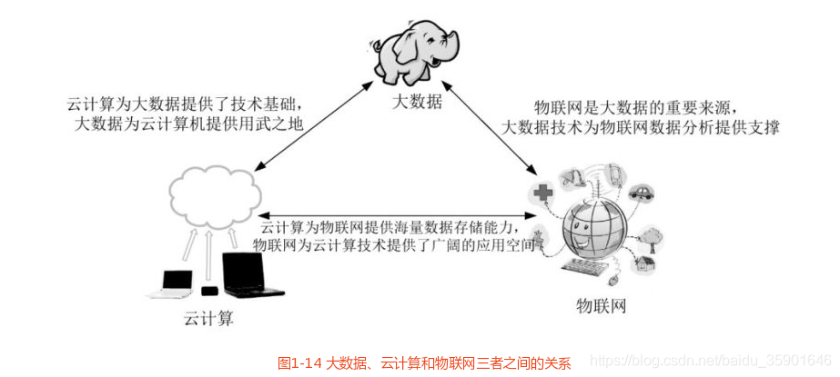

# 一、大数据概述

## 1 大数据时代

### 1.1 第三次信息浪潮

信息科技为大数据时代提供技术支撑

    1. 存储设备容量不断增加
    2. CPU处理能力大幅提升
    3. 网络宽带不断增加

数据生产方式的变革促成大数据时代的来临

    1. 运营式系统阶段
    2. 用户原创内容阶段
    3. 感知式系统阶段
    

### 1.2 大数据的概念

- **4V** ：数据量大（volume）、数据类型繁多（variety）、处理速度快（velocity）、价值密度低（value）

- 大数据对科学研究的影响：实验科学 --> 理论科学 --> 计算科学 --> 数据密度型科学

- 大数据对思维方式的影响：全样而非抽象 --> 效率而非精确 --> 相关而非因果

### 1.3 大数据的应用

制造、金融、汽车、互联网、餐饮、电信、能源、物流、城市管理、生物医学、体育锻炼、安全领域、个人生活

### 1.4 大数据与云计算、物联网

云计算：

    1. 三种服务模式 Iaas、Paas、Saas
    2. 公有云、私有云、和混合云

云计算的关键技术：

    1. 虚拟化
    2. 分布式存储
    3. 分布式运算
    4. 多租户
   
云计算数据中心：

    1. 谷歌
    2. 微软
    3. IBM
    4. 惠普
    5. 戴尔

    贵州被公认为我国南方最适合建设数据中心的地方

物联网：新一代信息技术的重要组成部分，具有广泛的用途。

大数据与云计算、物联网的关系

- 云计算为大数据提供了技术基础，大数据为云计算提供了用武之地
- 物联网是大数据的重要来源，大数据为物联网数据分析提供支撑
- 云计算为物联网提供海量数据存储能力，物联网为云计算提供广泛的应用空间

### 小结

- 4V
- 大数据对科学研究、思维方式、社会发展、就业市场和人才培养都产生了重要的影响
- 大数据与云计算、物联网的关系

# 二、大数据处理架构Hadoop

## 1 概述

### 1.1 Hadoop简介

Hadoop是Apache软件基金会旗下的一个开源分布式计算平台，Hadoop是基于Java语言开发的，具有很好的跨平台性。核心是分布式文件系统

### 1.2 Hadoop的特性

Hadoop是一个能够对大量数据进行分布式处理的软件框架，并且是一种可靠、高效、可伸缩的方式来进行处理的。
- 高可靠性
- 高效性
- 高可拓展性
- 高容错性
- 成本低
- 运行在Linux操作系统上
- 支持多种编程语言

## 2 Hadoop 生态系统

### HDFS

Hadoop分布式文件系统是Hadoop项目的两大核心之一，具有处理超大数据、流式处理、可以运行在廉价商用服务器上的优点。在设计之初就是要运行在廉价的大型服务器集群上，因此在设计上就把硬件故障作为一种常态来考虑，实现在故障的情况下仍然能够保证文件系统的整体可用性和可靠性。

### HBase

分布式列式数据库，一般采用HDFS作为其底层的数据存储系统

### MapReduce

一种编程模型，用于大规模数据集（大于1TB）的并行运算。

### Hive

基于Hadoop的数据仓库工具，可以用于Hadoop文件中的数据集进行数据整理，特殊处理和分析存储。

### Pig

Pig是一种数据流语言和运行环境，适用于Hadoop和MapReduce平台来查询大型半结构化数据集。

### Mahout

Mahout是Apache 软件基金会旗下的一个开源项目，提供一些可拓展的机器学习领域经典算法的实现，旨在帮助开发人员更加方便快捷低创建只能应用程序。

### Zookeeper

ZooKeeper，提供分布式锁之类的基本服务，

### Flume

分布式的海量日志采集、聚合和传输的系统。

### Sqoop

**Sql-to-Hadoop** 的缩写 主要用于Hadoop和关系数据库之间交换数据

### Ambari

基于web的工具，支持Hadoop集群的安装、部署、配置和管理。

## 3 Hadoop 的安装和使用

### 
